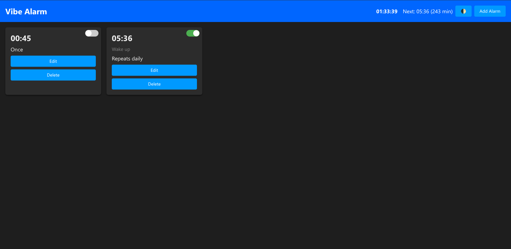

# Vibe Alarm

## Features
- Add, edit, delete alarms with optional label and repeat‑daily toggle.
- Persistent storage via **IndexedDB** – alarms survive reloads and browser restarts.
- Native desktop notifications when alarms trigger.
- Light / dark theme toggle (saved in `localStorage`).
- Installable Progressive Web App (PWA) with proper manifest and icons.