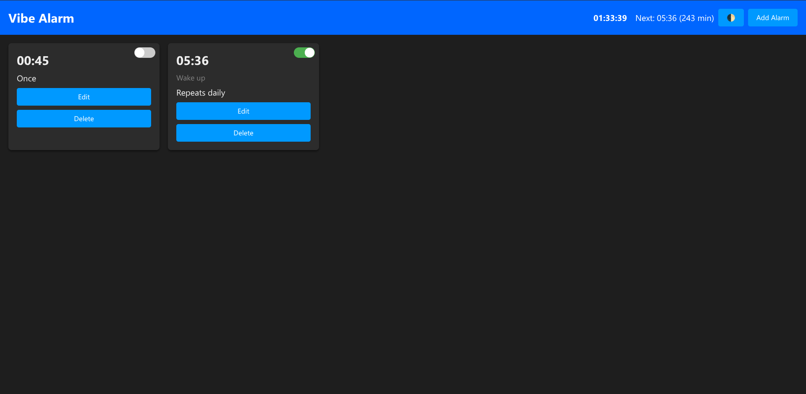

# Vibe Alarm

## How This Was Built

This app was built using **Vibe coding** — a local AI coding assistant running entirely on your machine with no external dependencies.

### Models Used (All Local, Free)
- **Gemma 4 E4B**: Gemma is Google's open-weight model, known for producing clean, idiomatic JavaScript and CSS without the "hallucinated frameworks" that often plague LLM-generated code.

- **Qwen 3.5 4b**: This is a powerful open-source model from Alibaba, designed specifically for efficient local execution and excellent reasoning capabilities.

### Hardware Specifications
- **OS:** Windows (Asus Vivobook)
- **CPU / RAM:** Intel i5 12450H / 16 GB
- **GPU:** Nvidia RTX 3050, 4 GB VRAM

## Features
- Add, edit, delete alarms with optional label and repeat‑daily toggle.
- Persistent storage via **IndexedDB** – alarms survive reloads and browser restarts.
- Native desktop notifications when alarms trigger.
- Light / dark theme toggle (saved in `localStorage`).
- Installable Progressive Web App (PWA) with proper manifest and icons.